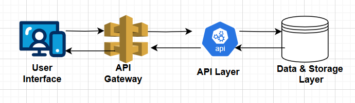
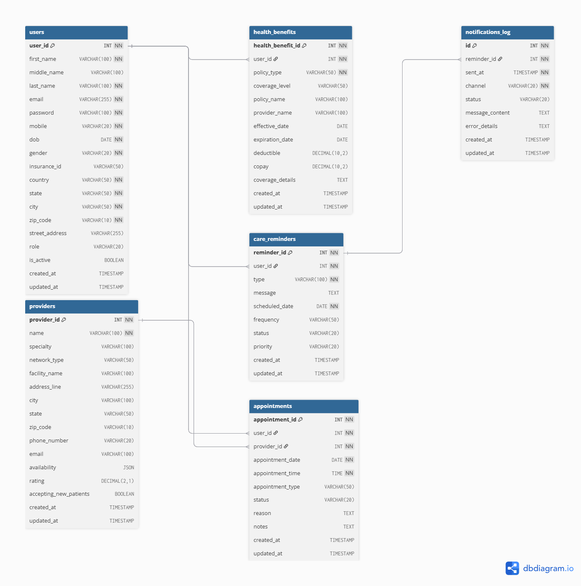
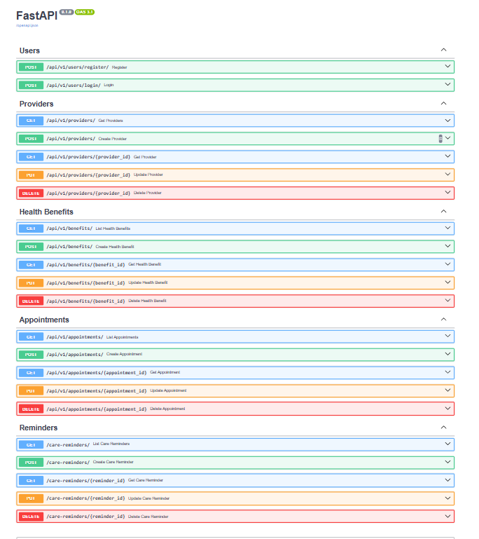

## About  
 `healthcare-assist.ai`  an intelligent and user-friendly virtual assistant for healthcare members. The assistant should streamline and enhance the member experience by offering accessible, personalized healthcare-related services

## High Level Design



## Schema/Tables Design 


- `Users` --> `health_benefits` [One-To-Many]
- `Users` --> `appointments` [One-To-Many]
- - - |---< `providers` [Many-To-One]
- `Users` --> `care_remainders` [One-To-Many]
- - - |---> `notifications_log` [One-To-Many]



## API endPoints 


## Managing Secrets
  To manage secrets securely, we can use tools like HashiCorp Vault or AWS Secrets Manager in production environments.
  
  For simulating the development environment, a .vault.json file is created under the /backend-api directory. This file contains sensitive configuration such as secret keys.
    
 Example .vault.json file:
 code
```
{
  "secret_key": "<YOUR_SECRET_KEY>"
}
```
*Important*: Make sure to add .vault.json to your .gitignore file to avoid committing secrets to version control.


## Execution Environment (backend)

Note :  Required python3.11 and above version 

1. Clone the source code and launch using VSCode Editor 
2. Open Teriminal and Navigate to `\backend-api` directory 
3. Create a virtual environment `python -m venv venv`
4. Activate virtual environment 
    - Windows:  venv\Scripts\activate
    - MacOS/Linux : source venv/bin/activate 
5. Run the dependencies `pip install -r requirements.txt`

###### TODO: 
Create pipenv instead of pip for managing dependencies and virtual environments to automatically creates and manages a virtual environment and maintains separate files for default (Pipfile) and locked (Pipfile.lock) dependencies.

It ensures reproducible builds across environments

## Run Tests
To run unittest 
python -m unittest discover -s tests
python -m unittest tests/test_module/<file_name>
  Example : python -m unittest tests/unit-tests/utils/test_vault_secrets.py
python -m unittest tests/test_module
###### TODO 
  - Need to implememt BDD Tests


## How to run fastAPI 
uvicorn <packagename>.main:app --reload
         └────┬────┘ └──┬──┘
              │         └── The FastAPI app object (`app = FastAPI()`)
              └──────────── The module path: folder `backend_api`, file `main.py`

uvicorn main:app --reload
Swagger: http://127.0.0.1:8000/docs

ReDoc: http://127.0.0.1:8000/redoc


## Resources Used 
To design database here is the link https://dbdiagram.io/d


